# РАЗРАБОТКА ИГРОВЫХ СЕРВИСОВ
Отчет по лабораторной работе #4 выполнил:
- Абзапаров Николай Дмитриевич
- РИ300012
### Ссылка на репозиторий с проектом: https://github.com/Abzaparov-Nikolay/DragonPicker

Отметка о выполнении заданий (заполняется студентом):

| Задание | Выполнение | Баллы |
| ------ | ------ | ------ |
| Задание 1 | * | 60 |
| Задание 2 | * | 20 |
| Задание 3 | * | 20 |

знак "*" - задание выполнено; знак "#" - задание не выполнено;

Работу проверили:
- к.т.н., доцент Денисов Д.В.
- к.э.н., доцент Панов М.А.
- ст. преп., Фадеев В.О.

## Цель работы
Подготовить разрабатываемое интерактивное приложение к сборке и публикации.

## Задание 1

1) Создал копию сцены, удалил Ground, переместил Enemy и Mountain, добавил дракону новую анимацию
    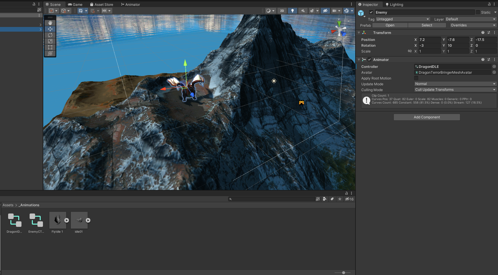
2) Скачал ассет пак с облаками, добавил облако к себе на сцену<br>
   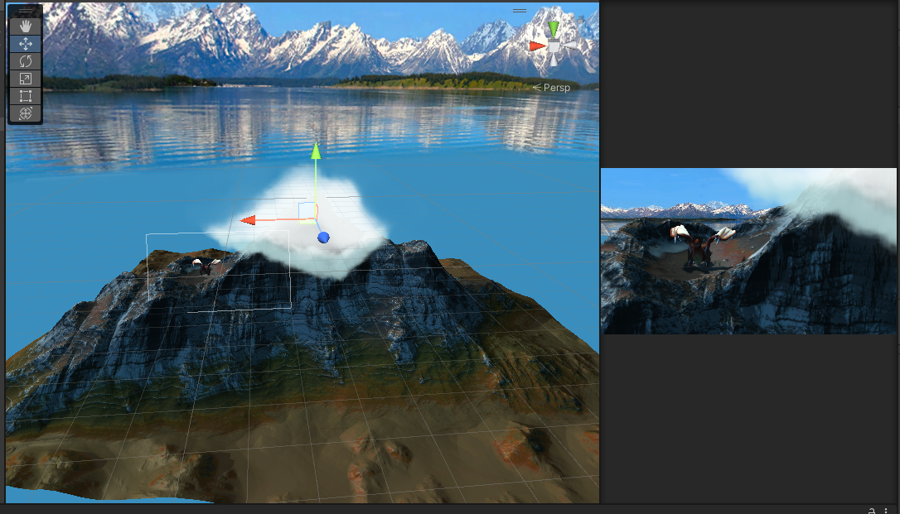
3) Создал анимацию для облака и прикрепил его в сцене<br>
   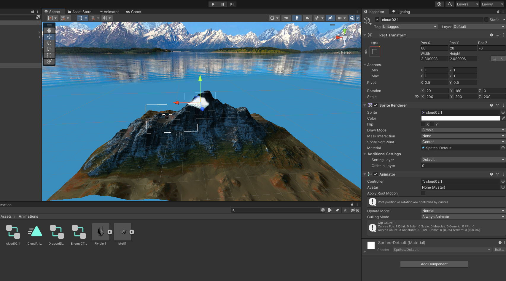
4) Добавил название игры на начальную сцену<br>
   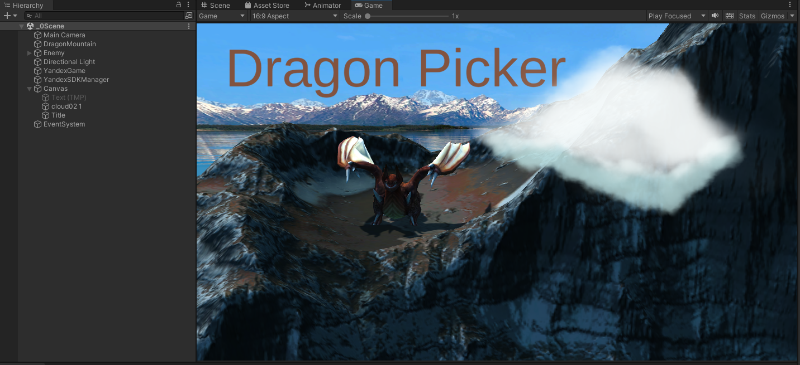
5) Создал элементы меню<br>
   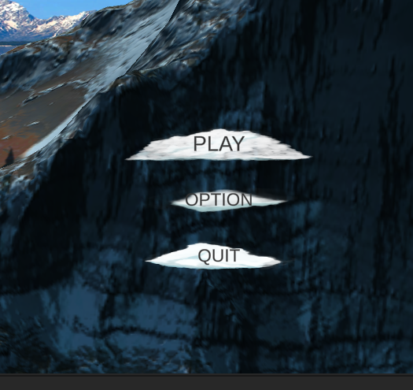
6) Добавил новую страницу меню<br>
   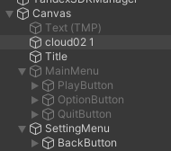
7) Создал скрипт Pause и прикрепил его к MainCamera в сцене с игрой<br>
```cs
   public class Pause : MonoBehaviour
   {
      private bool paused = false;
      public GameObject panel;

      void Update()
      {
         if (Input.GetKeyDown(KeyCode.Space))
         {
               if (!paused)
               {
                  paused = true;
                  Time.timeScale = 0;
                  panel.SetActive(true);
               }
               else
               {
                  paused = false;
                  Time.timeScale = 1;
                  panel.SetActive(false);
               }
         }
         if (Input.GetKeyDown(KeyCode.Escape))
         {
               SceneManager.LoadScene(SceneManager.GetActiveScene().buildIndex - 1);
         }
      }
   }
```
8) Из разных ассет паков добавил себе 4 звуковых дорожки<br>
   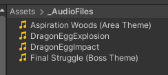
9) Добавил в префабах яйца и щита по AudioSource компоненту и прикрепил необходимые звуки<br>
    
10) В скриптах DragonEgg и EnergyShield реализовал проигрывание звуков падения яйца и ловли яйца соответственно<br>
    ``` cs
    var audioSource = GetComponent<AudioSource>();
    audioSource.Play();
    ```
11) Для проигрывания фоновых звуков добавил по AudioSource компоненту к MainCamera на каждой сцене. Прикрепил необходимые звуки.<br>
    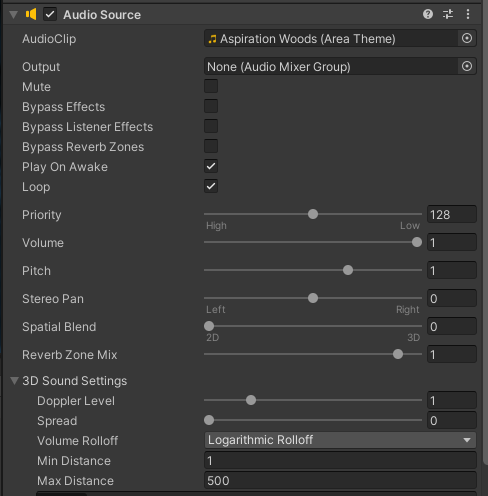
12) С сайта mixamo.com скачал модель персонажа с анимацией, добавил в проект, распаковал текстуры, добавил персонажа на сцену<br>
    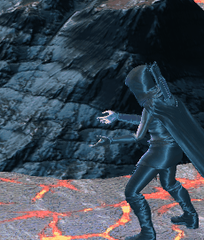
## Задание 2

Для изменения платформы билда нужно в настройках билда выбрать необходимую платформу, внести необходимые настройки(если требуется) и начать билд.<br>
У разных платформ возможны разные способы ввода, поэтому следует разделить систему обработки ввода и логику игры. <br>Также  сущесвуют дополнительные устройства ввода и сенсоры, такие как flight stick, xbox контроллеры, гироскоп, спидометр, часы. Можно добавить поддержку данных устройств


## Задание 3
1) Создал AudioMixer, создал две дочерние группы от Master Group<br>
   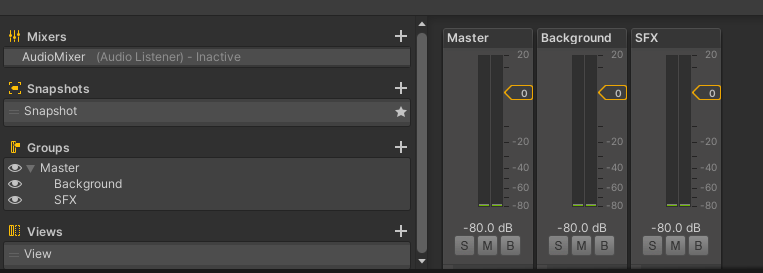
2) В SettingMenu Добавил два слайдера, подписал их с помощью TextMeshPro
   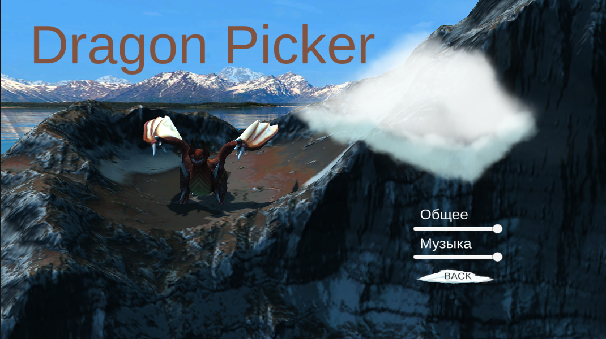
3) Создал скрипт VolumeController и прикрепил его к MainCamera на нулевой сцене
```cs
public class VolumeController : MonoBehaviour
{
    public AudioMixer audioMixer;
    
    public void SetMasterValue(float slideValue)
    {
        audioMixer.SetFloat("MasterVol", Mathf.Log10(slideValue)*20);
    }

    public void SetBackgroundValue(float slideValue)
    {
        audioMixer.SetFloat("BackgroundVol", Mathf.Log10(slideValue)*20);
    }

    public void SetSFXValue(float slideValue)
    {
        audioMixer.SetFloat("SFXVol", Mathf.Log10(slideValue)*20);
    }
}
```
4) Выбрал необходимые функции у слайдеров при изменении значения
   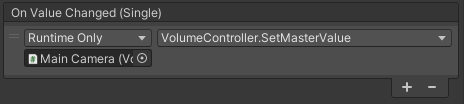
5) Теперь при изменении значения слайдеров, громкость звуком меняется
   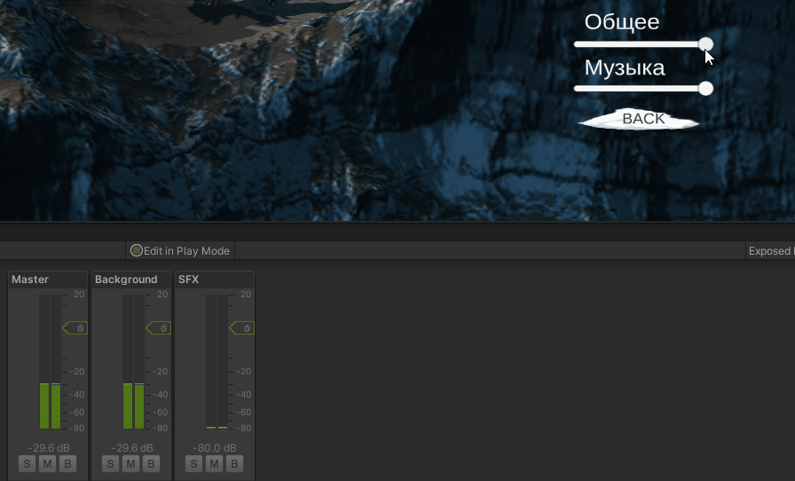


# Выводы
Научился манипулировать сценами в приложении, добавлять элементы менб и настраивать их, добавлять им функциональность. Научился работать со звуковыми группами. Узнал про сайт с моделями персонажа и анимациями к нему.
## Powered by

**BigDigital Team: Denisov | Fadeev | Panov**